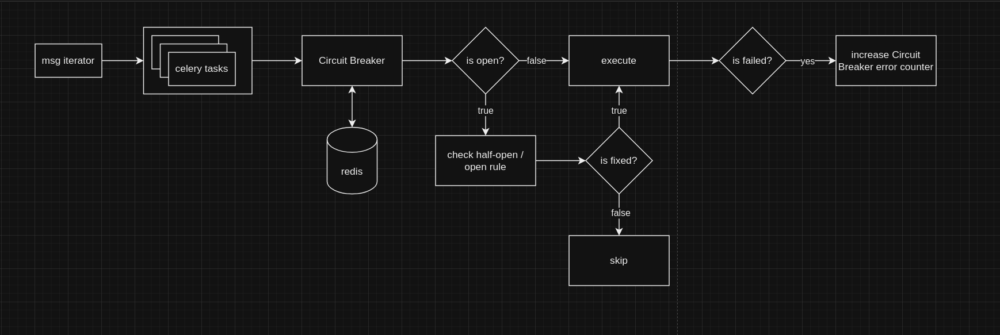

# Diagram


This is a high-level solution that naturally requires further refinement.

The main idea is to control error generation in Celery tasks using the [Circuit Breaker pattern](https://en.wikipedia.org/wiki/Circuit_breaker_design_pattern). 
I've added one of the patterns we can handle - error generation. We can also add timeouts, 
the number of tasks launched, and so on. Here in the logs, you can see how it works:

```log
# CB is closed and on task_b error was generated
[2024-02-18 19:57:36,460: WARNING/ForkPoolWorker-8] task_b msg: error
[2024-02-18 19:57:36,460: WARNING/ForkPoolWorker-8] CircuitBreaker is closed, execute task_b

[2024-02-18 19:57:37,463: WARNING/ForkPoolWorker-7] Success task executed: Message for task a
[2024-02-18 19:57:41,279: WARNING/ForkPoolWorker-7] task_a msg: Message for task a
[2024-02-18 19:57:42,282: WARNING/ForkPoolWorker-7] Success task executed: Message for task a

# CB is closed and on task_b error was generated
[2024-02-18 19:57:46,282: WARNING/ForkPoolWorker-7] task_b msg: error
[2024-02-18 19:57:46,282: WARNING/ForkPoolWorker-7] CircuitBreaker is closed, execute task_b

[2024-02-18 19:57:51,284: WARNING/ForkPoolWorker-7] task_a msg: Message for task a
[2024-02-18 19:57:52,287: WARNING/ForkPoolWorker-7] Success task executed: Message for task a

# CB is closed and on task_b error was generated
[2024-02-18 19:57:56,286: WARNING/ForkPoolWorker-7] task_b msg: error
[2024-02-18 19:57:56,287: WARNING/ForkPoolWorker-7] CircuitBreaker is closed, execute task_b

[2024-02-18 19:58:01,289: WARNING/ForkPoolWorker-7] task_a msg: Message for task a
[2024-02-18 19:58:02,291: WARNING/ForkPoolWorker-7] Success task executed: Message for task a

# The CB has been opened, further task execution will be skipped.
[2024-02-18 19:58:06,291: WARNING/ForkPoolWorker-7] task_b msg: error
[2024-02-18 19:58:06,291: WARNING/ForkPoolWorker-7] CircuitBreaker is closed, execute task_b
[2024-02-18 19:58:06,293: WARNING/ForkPoolWorker-7] open CircuitBreaker

[2024-02-18 19:58:11,293: WARNING/ForkPoolWorker-7] task_a msg: Message for task a
[2024-02-18 19:58:12,296: WARNING/ForkPoolWorker-7] Success task executed: Message for task a

# Skip task_b
[2024-02-18 19:58:16,295: WARNING/ForkPoolWorker-7] task_b msg: error
[2024-02-18 19:58:16,295: WARNING/ForkPoolWorker-7] CircuitBreaker is opened, skip task_b
[2024-02-18 19:58:16,295: WARNING/ForkPoolWorker-7] close CircuitBreaker

[2024-02-18 19:58:21,298: WARNING/ForkPoolWorker-7] task_a msg: Message for task a
[2024-02-18 19:58:22,300: WARNING/ForkPoolWorker-7] Success task executed: Message for task a

# CB was restored
[2024-02-18 19:58:26,299: WARNING/ForkPoolWorker-7] task_b msg: error
[2024-02-18 19:58:26,299: WARNING/ForkPoolWorker-7] CircuitBreaker is closed, execute task_b

```